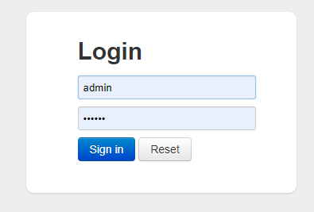
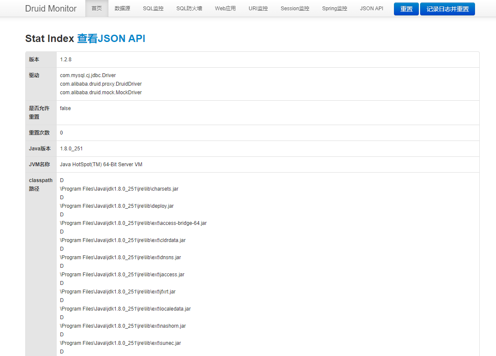
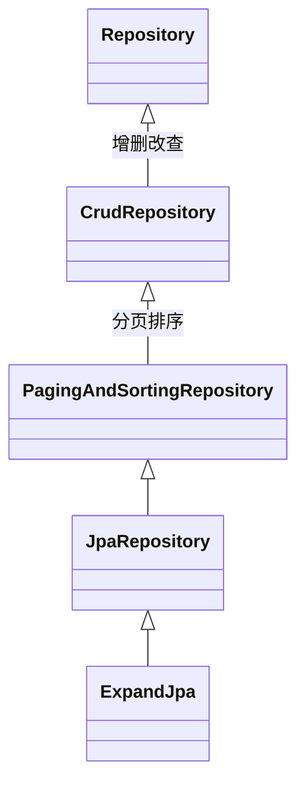
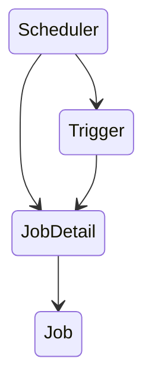

# 一步一步学SpringBoot2

> 书本对应的项目代码 https://github.com/huangwenyi10/stepbystep-learn-springboot


## 第一章 Spring Boot项目

### Spring Boot简单介绍

倡导“约定优先于配置”，设计目的是简化新Spring应用初始化搭建以及开发过程

### 搭建环境

1. 安装Java环境 1.8

2. 安装开发公交IDEA

3. 安装Maven环境 3.5


### 创建项目

1. 使用Spring Initializr新建项目
2. 启动项目

### 项目目录

1. src/main/java:放置所有Java文件
2. src/main/resource: 所有资源文件，包含静态资源文件，配置文件，页面文件
3. src/main/resource/static: 存放各种静态资源
4. src/main/resource/application.properties: 配置文件（非常重要), 默认支持格式, properties, .yml
5. src/main/resource/tmeplates: 存放模板文件， Thymeleaf等模板文件
6. src/test/java: 单元测试类Java 代码
7. target: 放置编译后的.class文件，配置文件等。

> 如果同时存在application.properties 和 application.yml 两个配置文件，.propertis 配置文件优先级高于 .yml


## 第二章 集成MySQL数据库

### 引入依赖

在 `pom.xml` 文件中引入依赖

```xml
        <dependency>
            <groupId>mysql</groupId>
            <artifactId>mysql-connector-java</artifactId>
        </dependency>
        <dependency>
            <groupId>org.springframework.boot</groupId>
            <artifactId>spring-boot-starter-jdbc</artifactId>
        </dependency>
```


### 添加数据库配置

在application.properties配置数据连接信息

```properties
### msyql连接信息
spring.datasource.url = jdbc:mysql://127.0.0.1:3306/test

### 用户名
spring.datasource.username=root
### 密码
spring.datasource.password=root
### 驱动
spring.datasource.driver-class-name=com.mysql.jdbc.Driver

```


### 设计表和实体

创建ky_user表，包含字段id, name, password

```mysql
drop table if exists `ky_user`;
create table `ky_user` (
	`id` varchar(32) not null comment '主键',
    `name` varchar(10) default null comment '用户名',
    `password` varchar(10) default null comment '密码'
);
```


插入数据 到表里面

```mysql
insert into `ky_user`(`id`, `name`, `password`) values('1', 'kyle', '123456');
insert into `ky_user`(`id`, `name`, `password`) values('2', 'matt', '1424523');
```


添加用户对象类

```java
package com.example.myspringboot.model;

public class KyUser {
    private String id;
    private String name;
    private String password;

    public KyUser() {
    }

    public KyUser(String id, String name, String password) {
        this.id = id;
        this.name = name;
        this.password = password;
    }

    public String getId() {
        return id;
    }

    public void setId(String id) {
        this.id = id;
    }

    public String getName() {
        return name;
    }

    public void setName(String name) {
        this.name = name;
    }

    public String getPassword() {
        return password;
    }

    public void setPassword(String password) {
        this.password = password;
    }

    @Override
    public String toString() {
        return "KyUser{" +
                "id='" + id + '\'' +
                ", name='" + name + '\'' +
                ", password='" + password + '\'' +
                '}';
    }
}

```


### 集成测试

在MySpringBootApplicationTests.java中添加代码

```java

    @Resource
    private JdbcTemplate jdbcTemplate;

    /**
     * myql 集成Spring Boot简单测试
     */
    @Test
    public void mysqlTest(){
        String sql = "select id,name, password from `ky_user`";
        List<KyUser> userList = (List<KyUser>) jdbcTemplate.query(sql, new RowMapper<KyUser>() {
            @Override
            public KyUser mapRow(ResultSet rs, int rowNum) throws SQLException {
                KyUser user = new KyUser();
                user.setId(rs.getString("id"));
                user.setName(rs.getString("name"));
                user.setPassword(rs.getString("password"));
                return user;
            }
        });

        System.out.println("查询成功：");
        for (KyUser kyUser : userList) {
            System.out.println(kyUser.toString());
        }
    }
```

执行mySqlTest单元测试方法，打印的信息如下

```
查询成功：
KyUser{id='1', name='kyle', password='123456'}
KyUser{id='2', name='matt', password='1424523'}
```


### Mysql客户端安装使用

1. 安装Navicat for MySQL
2. 使用IDEA 的 Database连接数据库


### 集成Druid

#### Druid介绍

Druid 是阿里巴巴开源项目中的一个数据库连接池。Druid是一个JDBC组件， 包含三部分

1. DruidDriver 代理 Driver, 能够提供基于Filter-Chain模式的插件体系；
2. DruidDataSource高效可管理的数据库连接池；
3. SQLParser, 支持所有JDBC兼容的数据库， 包括 Oracle，MySQL，SQL Server等。

Druid在监控，可扩展，稳定性和性能方面举有明显的优势，通过其提供的监控功能可以观察数据库连接池和SQL查询的工作情况，使用Druid 连接池可以提高数据库的访问性能。

#### 引入依赖

在 `pom.xml` 文件中引入依赖

```xml
	<dependency>
            <groupId>com.alibaba</groupId>
            <artifactId>druid</artifactId>
            <version>1.2.8</version>
	</dependency>
```

#### 添加配置

在`application.properties` 文档中添加 `Druid`配置

```properties

### druid 配置
### 数据源类别
spring.datasource.type=com.alibaba.druid.pool.DruidDataSource
### 初始化大小，最小，最大连接数
spring.datasource.initialSize=5
spring.datasource.minIdel=5
spring.datasource.maxActive=15
### 配置获取连接等待超时的时间，单位是毫秒
spring.datasource.maxWait=6000
### 配置间隔多久才进行一次检测，检测需要关闭的空余连接，单位是毫秒
spring.datasource.timeBetweenEvicitionRunsMillis=60000
### 配置一个连接在池中最小生存时间，单位是毫秒
spring.datasource.minEvictableIdleTimeMillis=300000
spring.datasource.validactionQuery=SELECT 1 FROM DUAL
spring.datasource.testWhileIdle=true
spring.datasource.testOnBorrow=false
spring.datasource.testOnReturn=false
### 打开PSCache,并且指定每个连接上PSCache的大小
spring.datasource.poolPreparedStatments=true
spring.datasource.maxPoolPreparedStatementPerConnectionSize=20
### 配置监控统计拦截的filters,去掉后监控界面的SQL无法统计, 'wall' 用于防火墙
spring.datasource.filters=stat,wall,log4j
### 通过connectProperties属性来打开mergeSql功能，慢SQL记录
spring.datasource.connectionProperties=druid.stat.mergeSql=true;druid.stat.slowSqlMillis=5000
### 合并多个DruidDataSource的监控数据
#spring.datasource.useGlobalDataSourceStat=true

```


#### 开启监控功能

开启方法

1. 使用原生的Servlet, Filter 方式，然后通过@SevletComponentScan启用扫描包进行处理；
2. 使用代码注册Servlet 和 Filter的方式处理；

> 使用第二种方式开启

添加配置列 DruidConfiguration.java


```java
package com.example.myspringboot.filter;

import com.alibaba.druid.support.http.StatViewServlet;
import com.alibaba.druid.support.http.WebStatFilter;
import org.springframework.boot.web.servlet.FilterRegistrationBean;
import org.springframework.boot.web.servlet.ServletRegistrationBean;
import org.springframework.context.annotation.Bean;
import org.springframework.context.annotation.Configuration;

/**
 * @Configuration
 * 相当于把该类变成了配置文件
 */
@Configuration
public class DruidConfiguration {

    /**
     * @Bean
     * 等同于配置文件里面的Bean
     * Spring Boot会将方法返回值装置进SpringIoc容器
     * 方法的名称对应 bean 标签的 ID属性
     * @return
     */
    @Bean
    public ServletRegistrationBean druidStatViewServlet() {
        //ServletRegistrationBean 提供类的注册

        ServletRegistrationBean servletRegistrationBean = new ServletRegistrationBean(new StatViewServlet(), "/druid/*");

        //添加初始化参数： initParams
        //白名单：
        servletRegistrationBean.addInitParameter("allow","127.0.0.1");
        //IP黑名单（存在共同时，deny优先于allow)
        //如果满足deny, 就提示：Sorry, you ara not permitted to view this page.servletRegistrationBean.addInitParameter("deny","");

        //登陆查看信息的账号和密码
        servletRegistrationBean.addInitParameter("loginUsename","admin");
        servletRegistrationBean.addInitParameter("loginPassword","123456");

        //是否能够重置数据
        servletRegistrationBean.addInitParameter("resetEnable", "false");
        return servletRegistrationBean;

    }

    @Bean
    public FilterRegistrationBean druidStatFilter(){
        FilterRegistrationBean filterRegistrationBean = new FilterRegistrationBean(new WebStatFilter());
        //添加过滤规则
        filterRegistrationBean.addUrlPatterns("/*");
        filterRegistrationBean.addUrlPatterns("exclusions","*.js,*.gif,*.jpg,*.png,*.css,*.ico,/druid/*");
        return filterRegistrationBean;
    }
}

```


#### 测试

访问：http://127.0.0.1:8080/druid/login.html

输入账号密码：admin	123456






## 第三章 集成Spring Data JPA

> 主要内容介绍Spring Data JPA 核心接口及继承关系，在Spring Boot 中集成Spring Data JPA 以及如果通过Spring Data JPA 实现增删改查以及自定义查询等。


### JPA

<b>JPA ( Java Persistence API)</b> 是Sun官方提出的Java 持久化规范。 自定义标准规则，不提供实现。

现有的JPA实现有 Hibernate, EclipseLink, OpenJPA等

<b>Spring Data JPA</b> 是 Spring Data的一个子项目，通过提供基于JPA的Repository极大地减少了JPA作为数据访问方案的代码量。

### 核心接口 Repository

<b>Spring Data JPA </b>最顶层的接口是Repository， 该接口是所有Repository类的父类。

```java
package org.springframework.data.repository;
import java.io.Serializable;
public interface Repository<T, ID extends Serializable>{
    
}
```

Repository类下没有任何接口，只是一个空类。

### Repository接口间的继承关系




> @NoRepositoryBean: 使用该注解表明此接口不是一个Repository Bean


### 集成Spring Data JPA

> 如何在Spring Boot 中集成 Java Data JPA, 服务层类开发， 实现基本的增删该查功能，以及自定义查询方法等内容。


#### 引入依赖

在 `pom.xml` 文件中引入依赖

```xml
        <dependency>
            <groupId>org.springframework.boot</groupId>
            <artifactId>spring-boot-starter-data-jpa</artifactId>
        </dependency>
```


#### 集成JpaRepository

在包 `repository` 内添加 `KyUserRepository.java ` 接口类

```java
package com.example.myspringboot.repository;

import com.example.myspringboot.model.KyUser;
import org.springframework.data.jpa.repository.JpaRepository;


public interface KyUserRepository extends JpaRepository<KyUser, String> {

}

```

修改`KyUser.java`用户类，添加@Entity, @Id 注解

```java
package com.example.myspringboot.model;

import javax.persistence.Entity;
import javax.persistence.Id;
import javax.persistence.Table;

@Entity
@Table(name = "ky_user")
public class KyUser {

    //主键
    @Id
    private String id;
    private String name;
    private String password;
}
```


@Entity：每个持久化POJO类都是一个实体 Bean, 通过在类中使用@Entity注解进行声明。

@Table：声明此对象映射到数据库的数据表。该注释不是必需的，如果没有，系统就会使用默认值，实体的短类名。

@Id： 指定表的主键，必须。


#### 服务层类实现

添加包 service, service.impl

在包service下添加 `KyUserService.java` 类

在包service.impl 下添加 `KyUserServiceImpl.java` 类

```java
package com.example.myspringboot.service;

import com.example.myspringboot.model.KyUser;

import java.util.List;

/**
 * 用户服务层接口
 */
public interface KyUserService {
    KyUser findById(String id);
    List<KyUser> findAll();
    KyUser save(KyUser kyUser);
    void delete(String id);
}

```


```java
package com.example.myspringboot.service.impl;

import com.example.myspringboot.model.KyUser;
import com.example.myspringboot.repository.KyUserRepository;
import com.example.myspringboot.service.KyUserService;
import org.springframework.stereotype.Service;

import javax.annotation.Resource;
import java.util.List;
import java.util.Optional;

/**
 * 用户服务层实现类
 */
@Service
public class KyUserServiceImpl implements KyUserService {

    @Resource
    private KyUserRepository kyUserRepository;

    @Override
    public KyUser findById(String id) {
        return kyUserRepository.findById(id).orElse(null);
    }

    @Override
    public List<KyUser> findAll() {
        return kyUserRepository.findAll();
    }

    @Override
    public KyUser save(KyUser kyUser) {
        return kyUserRepository.save(kyUser);
    }

    @Override
    public void delete(String id) {
        kyUserRepository.deleteById(id);
    }
}

```


- @Service： Spring Boot会自动扫描到@Component注解的类，并吧这些类归纳入Spring容器中管理。也可以用@Component 注解，只是@Service注解更能表明该类是服务层类。
- @Component：泛指组件，当组件不好归类的时候，可以使用该注解进行标注。
- @Repository：持久层组件，标注数据访问组件，即DAO组件。
- @Resouce：属于J2EE，默认按照名称进行装配，名称可以通过name属性进行指定。如果没有指定name属性，当注解写在字段上时，就默认取字段名进行查找。如果注解写在setter方法上，就默认取属性名进行装配。当找不到与名称匹配的bean时，才按照类型进行装配。name属性一旦指定，就只会按照名称进行装配。

```java
@Resource(name ="kyUserRepository")
private KyUserRepository kyUserRepository;
```

- @Autowired：这个注解属性Spring，默认按类型装配。默认情况下，要求依赖对象必须存在，如果允许null值，那么可以设置它的required属性为false，如@Autowired(required=false)；如果想使用名称装配，那么可以结合@Qualifier注解使用。

```java
@Autowired
@Qualifier("kyUserRepository")
private KyUserRepository kyUserRepository;
```


#### 分页简单实现

在用户服务层接口 添加 分页 查询接口

```java
package com.example.myspringboot.service;

import com.example.myspringboot.model.KyUser;
import org.springframework.data.domain.Page;
import org.springframework.data.domain.Pageable;

import java.util.List;

/**
 * 用户服务层接口
 */
public interface KyUserService {
    //查询
    KyUser findById(String id);
    //获取全部
    List<KyUser> findAll();
    //新增或更新
    KyUser save(KyUser kyUser);
    //删除
    void delete(String id);

    //分页
    Page<KyUser> findAll(Pageable pageable);
}

```


- Pageable：这是一个分页接口，查询时时只需要传入一个Pageable接口的实现类，指定pageNumber 和 pageSize即可。 pageNumber 为第几页， pageSize 为分页大小。 
- Page：分页查询结果会封装在该类中，Page接口实现Slice接口，通过查看其源代码可知。我们通过调用getTotolPages 和 getContent等方法可以很方便地获得总页数和查询的记录。 Page 接口 和 Slice 源代码如下

```java
public interface Page<T> extends Slice<T>{
    int getTotalPages();
    long getTotalElements();
    <S> Page<S> map(Converter<? super T, ? extends S> var1)
}

public interface Slice<T> extends Iterable<T>{
    int getNumber();
    int getSize();
    int getNumberOfElements();
    List<T> getContent();
    boolean hasContent();
    Sort getSort();
    boolean isFirst();
    boolean isLast();
    boolean hasNext();
    boolean hasPrevious();
    Pageable nextPageable();
    Pageable previousPageable();
    <S> Slice<S> map(Converter<? suepr T, ? extends S> varl);
}
```

在服务端用户实现类实现分页方法

```java

/**
 * 用户服务层实现类
 */
@Service
public class KyUserServiceImpl implements KyUserService {
    //省略代码

    
    /**
     * 分页方法
     * @param pageable
     * @return
     */
    @Override
    public Page<KyUser> findAll(Pageable pageable) {
        return kyUserRepository.findAll(pageable);
    }
```


#### 自定义查询方法

> 除了jpa提供的增删改查分页方法外，可以自定义查询方法。
>
> 在KyUserRepository.java 类中定义

```java
package com.example.myspringboot.repository;

import com.example.myspringboot.model.KyUser;
import org.springframework.data.jpa.repository.JpaRepository;

import java.util.Collection;
import java.util.List;


public interface KyUserRepository extends JpaRepository<KyUser, String> {

    /**
     * 描述：通过名字相等查询，参数为name
     * 相当于：select u from ky_user u where u.name = ?1
     * @param name
     * @return
     */
    List<KyUser> findByName(String name);

    /***
     * 描述：通过名字like查询，参考为name
     * 相当于：select u from ky_user u where u.name like ?1
     * @param name
     * @return
     */
    List<KyUser> findByNameLike(String name);

    /***
     * 描述：通过主键id集合查询，参数为id集合
     * 相当于：select u from ky_user u where u.id in(?,?,?)
     * @param ids
     * @return
     */
    List<KyUser> findByIdIn(Collection<String> ids);
}


```

在 KyUserService.java类中添加调用这些查询方法的接口方法

```java
package com.example.myspringboot.service;

import com.example.myspringboot.model.KyUser;
import org.springframework.data.domain.Page;
import org.springframework.data.domain.Pageable;

import java.util.Collection;
import java.util.List;

/**
 * 用户服务层接口
 */
public interface KyUserService {
	//省略代码(增删改查分页)
    
    //自定义查询方法
    
    //根据名字查询
    List<KyUser> findByName(String name);
    //根据名称进行模糊查询
    List<KyUser> findByNameLike(String name);
    //根据主键列表包含查询
    List<KyUser> findByIdIn(Collection<String> ids);
}
```


在KyUserServiceImpl.java中实现服务端接口新增的方法

```java
package com.example.myspringboot.service.impl;
//...省略引用
    
/**
 * 用户服务层实现类
 */
@Service
public class KyUserServiceImpl implements KyUserService {

    @Resource
    private KyUserRepository kyUserRepository;

    //...省略代码


    /**
     * 通过名字相等查询，参数为name
     * @param name
     * @return
     */
    @Override
    public List<KyUser> findByName(String name) {
        return kyUserRepository.findByName(name);
    }

    /**
     * 通过名字like查询
     * @param name
     * @return
     */
    @Override
    public List<KyUser> findByNameLike(String name) {
        return kyUserRepository.findByNameLike(name);
    }

    /**
     * 通过主键id集合查询
     * @param ids
     * @return
     */
    @Override
    public List<KyUser> findByIdIn(Collection<String> ids) {
        return kyUserRepository.findByIdIn(ids);
    }

}

```


> 自定义了3个查询方法， Spring Date JPA为我们约定了一系列规范，只要按照规范编写代码，Spring Data JPA就会根据代码翻译成相关的SQL语句，进行数据库查询。比如可以使用findBy,Like,In等关键字， 其中findBy可以用read, readBy, query, queryBy, get, getBy来代替。 
>
> 其他关键字可以在网站中查询：https://docs.spring.io/spring-data/data-jpa/docs/current/reference/html/

#### 集成测试

在测试类`MySpringBootApplicationTest.java`中添加测试代码

```java

    @Resource
    private KyUserService kyUserService;

    @Test
    public void testRepository(){
        //查询所有数据
        List<KyUser> userList = kyUserService.findAll();
        System.out.println("findALl() : " + userList.size());

        //通过name查询数据
        List<KyUser> userList1 = kyUserService.findByName("kyle");
        System.out.println("findByName() : " + userList1.size());
        Assert.isTrue(userList1.get(0).getName().equals("kyle"), "data error!");

        //通过name模糊查询
        List<KyUser> userList2 = kyUserService.findByNameLike("%ma%");
        System.out.println("findByNameLike() : " + userList2.size());
        Assert.isTrue(userList2.get(0).getName().equals("matt"), "data error!");

        //通过id列表查询
        List<String> ids = new ArrayList<>();
        ids.add("1");
        ids.add("2");

        List<KyUser> userList3 = kyUserService.findByIdIn(ids);
        System.out.println("findByIdIn() : " + userList3.size());

        //分页查询
        PageRequest pageRequest = PageRequest.of(0,10);
        Page<KyUser> userList4 = kyUserService.findAll(pageRequest);
        System.out.println("page findAll() : " + userList4.getTotalElements() + "/" + userList4.getSize());

        //新增数据
        KyUser kyUser = new KyUser();
        kyUser.setId("4");
        kyUser.setName("FMMMM");
        kyUser.setPassword("123432123");
        kyUserService.save(kyUser);

        //删除数据
        kyUserService.delete("3");

    }
```


- Assert：添加Assert断言在软件开发中是一种常用的调试方式。冲理论上来说通过Assert断言方式可以证明程序的正确性，现在在项目中被广泛使用，这是大家需要掌握的基本知识。.Assert提供了很多好用的方法比如IsNull,isTrue等 .

#### 测试


## 第四章 Thymeleaf模板引擎


1. 介绍Thymeleaf 模板引擎
2. Thymeleaf模板引擎标签和函数
3. Springboot中如何使用Thymeleaf
4. 集成测试
5. Rest Client工具的使用


### Thymeleaf 模板引擎介绍

​	Thymelaaf是一个优秀的，面向JAVA的XML/XHMTL/HMTL5页面模板，具有丰富的标签语言和函数。因此，在使用Spring Boot 框架进行页面设计时，一般都会选择Thymeleaf模板。

#### 常用表达式

- ${...}：变量表达式
- *{...}：选择表达式
- #{...}：消息文字表达式
- @{...}：链接url表达式
- #maps：工具对象表达式

#### 常用标签

- th:action：定义后台控制器路径
- th:each：循环语句
- th:field：表单字段绑定
- th:href：定义超链接
- th:id：div标签中的ID声明，类似HTML标签中的ID属性
- th:if：条件判断语句
- th:include：布局标签，替换内容到引入文件
- th:fragment：布局标签，定义一个代码片段，方便其他地方引用
- th:object：替换对象
- th:src：图片类地址引入
- th:text：显示文本
- th:value：属性赋值

#### 常用函数

- #datas：日期函数
- #list：列表函数
- #arrays：数组函数
- #strings：字符串函数
- #numbers：数字函数
- #calendars：日历函数
- #objects：对象函数
- #bools：逻辑函数

### 使用Thymeleaf模板引擎

#### 引入依赖

在 `pom.xml` 文件中引入依赖

```xml
        <dependency>
            <groupId>org.springframework.boot</groupId>
            <artifactId>spring-boot-starter-thymeleaf</artifactId>
        </dependency>
```


#### 添加配置

在`application.properties` 文档中添加 `Druid`配置

```properties
### thymeleaf 配置
# 模板的模式，支持HTML, XML, TEXT, JAVASCRIPT 等
spring.thymeleaf.mode=HTML5
# 编码，可不用配置
spring.thymeleaf.encoding=UTF-8
# 内容类别，可不用配置
spring.thymeleaf.content-type=text/html
# 开发配置为false, 避免修改模板还要重启服务器
spring.thymeleaf.cache=false
# 配置模板路径，默认是templates,可以不用配置
#spring.thymeleaf.prefix=classpath:/templates
```


<font color='red' size=6.2>注意：</font>Thymeleaf模板引擎默认会读取my-spring-boot项目资源文件夹resource下的template目录，这个目录是用来存放HTML文件的。如果我们添加了Thymeleaf依赖，但没有进行任何配置或者添加默认目录，启动应用时就会保存。


#### 控制层开发

添加`KyUserController.java`在 `controller`包下

```java
package com.example.myspringboot.controller;

import com.example.myspringboot.model.KyUser;
import com.example.myspringboot.service.KyUserService;
import org.springframework.stereotype.Controller;
import org.springframework.ui.Model;
import org.springframework.web.bind.annotation.RequestMapping;

import javax.annotation.Resource;
import java.util.List;

@Controller
@RequestMapping("/kyUser")
public class KyUserController {

    @Resource
    private KyUserService kyUserService;

    @RequestMapping("/test")
    public String test(Model model){
        //查询数据库所有用户信息
        List<KyUser> kyUserList = kyUserService.findAll();
        model.addAttribute("users", kyUserList);
        return "kyUser";//对应前端页面文件名字
    }
}

```

- @Controller：标注此类为一个控制层类，同时让Spring Boot容器管理起来。
- @RequestMapping：处理请求地址映射，可用于类和类的方法。用于类，表示类中的所有响应请求的方法都是以该地址作为父路径的。@RequestMapping注解有value, method等属性
- Model对象：一个接口，可以把数据设置到该类中，前端会从该对象中获取数据，实现类ExtendedModelMap

```java
public class ExtendedModelMap extends ModelMap implements Model{
    public ExtendedModelMap(){
        
    }
}
```


#### Thymeleaf模板页面开发

在`/src/main/resources/templates `目录下添加 `kyUser.html `页面

```html
<!DOCTYPE html>
<html lang="en" xmlns:th="http://www.thymeleaf.org">
<head>
    <meta charset="UTF-8">
    <meta http-equiv="Content-Type" content="text/html" charset="UTF-8">
    <title>Title</title>
</head>
<body>
<table>
  <tr>
    <td>用户名</td>
    <td>密码</td>
  </tr>
  <tr th:each="user:${users}">
    <td th:text="${user.name}"></td>
    <td th:text="${user.password}"></td>
  </tr>
</table>
</body>
</html>
```

- `<html lang="en" xmlns:th="http://www.thymeleaf.org">`是Thymeleaf命名空间，通过引入该命名空间就可以在Html中使用Thymeleaf标签语言，关键字用'th'来标注。

#### 测试

1. 启动项目
2. 访问`http://127.0.0.1:8080/kyUser/test`


### Rest Client工具

Rest Client是一个用于测试RESTful Web Service的Java客户端，非常小巧，界面非常简单。IDEA已经集成该插件，方便我们进行调试。我们可以在IntelliJ IDEA功能菜单中，Tool -> Test RESTful Web Service

没有的话，需要在setting ->plugs插件,查找添加插件 RestfulTookit


## 第五章 Spring Boot事务支持


### Spring事务


#### Spring事务介绍

事务用于确保数据的完整性和一致性，有如下4大特性

1. 原子性（Atomicity）
2. 一致性（Consistency）
3. 隔离性（Isolation）
4. 持久性（Durability）

作为企业级应用程序框架，Spring在不同的事务管理API上定义了一个事务层，而应用程序开发人员不必了解底层的事务管理API,就可以使用Spring的事务管理机制。

<b>Spring 支持编程式事务管理（也称编码式事务），也支持声明式事务管理</b>

<h4>编程式事务管理</h4>

<p>是指将事务管理代码嵌入业务方法中控制事务的提交和回滚，在编程式事务中，必须在每个业务操作中包含额外的事务管理代码。</p>

<h4>声明式事务管理</h4>

<p>是指将事务管理代码从业务中分离出来，以声明的方式来实现事务管理。在大多数情况下，声明式事务管理比编程式事务管理好用。Spring 通过 Spring AOP 框架支持声明式事务管理。</p>


#### Spring声明式事务

Spring 配置文件中关于事务配置总是由三部分组成，分别是

1. DataSource

2. TransactionManager

3. 代理机制

无论哪种配置方式，一般变化的只是代理机制部分，<b>DataSource </b>和 <b>TransactionManager</b>这两部分只会根据数据访问方式有所变化，比如使用Hibernate进行数据访问时，<b>DataSource </b>实现为SessionFactory, <b>TransactionManager</b> 的实现为HibernateTransactionManager等。

Spring声明事务配置提供了5种方式，而基于Annotation的注解方式目前比较流行，所有这里只简单介绍基于注解方式配置Spring声明式事务。

使用@Transactional注解在类或类方法中表明该类或者方法需要事务支持，被注解的类或者方法被调用时，Spring开启一个新的事务，当方法正常运行时，Spring会提交这个事实。

```java
@Transactional
public KyUser udpateUser(){
    //执行数据库操作
}
```


 <font color=red size=5>@Transactional 注解来自 org.springframework.transaction.annotation`；</font>

<font color=red size=5>Spring提供了 `@EnableTransactionMangement` 注解在配置类上来开启声明式事务支持。</font>

<font color=red size=5>使用 `@EnableTransactionManagement` 后，Spring容器会自动扫描注解`@Transactional`的方法和类。</font>


#### Spring 注解事务行为

当事务方法被另外一个事务方法调用时，必须指定事务应该如何传播。例如方法可能继续在现有事务中运行，也可能在一个新事务，并在自己的事务中运行。事务的传播行为可以在@Transactional的属性中指定。


Spring定义了7中传播行为

| 传播行为                      | 含义                                                         |
| :---------------------------- | :----------------------------------------------------------- |
| **PROPAGATION_REQUIRED**      | 如果当前没有事务，就新建一个事务；如果已经存在一个事务，就加入这个事务中 |
| **PROPAGATION_SUPPORTS**      | 支持当前事务，如果当前没有事务，就以非事务方式执行           |
| **PROPAGATION_MANDATORY**     | 使用当前的事务，如果当前没有事务，就抛出异常                 |
| **PROPAGATION_REQUIRES_NEW**  | 新建事务，如果当前存在事务，就把当前事务挂起                 |
| **PROPAGATION_NOT_SUPPORTED** | 以非事务方式执行，如果存在当前事务，就吧当前事务挂起         |
| **PROPAGATION_NEVER**         | 以非事务方式执行，如果当前存在事务，就抛出异常               |
| **PROPAGATION_NESTED**        | 如果当前存在事务，就嵌套事务内执行；如果当前没有事务，就执行与PROPAGATION_REQUIRED类型的操作 |

隔离级别定义了一个事务可能受其他并发事务影响的程度。在典型的应用程序中，多个事务并发运行经常会操作相同的数据来完成各自的任务。并发虽然是必需品，可是会导致许多问题，并发事务所导致的问题可以分为以下三类。

1. 脏读（Dirty Read)：脏读发生在一个事务读取另外一个事务改写但是尚未提交的数据。如果改写在稍后回滚了，那么第一个事务获取的数据就是无效的。
2. 不可重复读（Nonrepeatable Read）：不可重复读发生在一个事务执行相同的查询两次或两次以上，但是每次都得到不同的数据时。通常是因为另一个并发事务在两次查询期间更新了数据。
3. 幻读（Phantom Read）：幻读与不可重复读类似，发生在一个事务（T1）读取了几行数据，接着另一个并发事务（T2）插入了一些数据时。在随后的查询中，第一个事务（T1）就会发现了一些原本不存在的记录。

针对这些问题，Spring提供了5种事务隔离级别

| 隔离级别                       | 含义                                                         |
| ------------------------------ | ------------------------------------------------------------ |
| **ISOLATION_DEFAULT**          | 使用数据库默认的事务隔离级别                                 |
| **ISOLATION_READ_UNCOMMITTED** | 事务最低的隔离级别，允许另一个事务可以看到这个事务未提交的数据。这种隔离级别会产生脏读，不可重复读和幻读 |
| **ISOLATION_READ_COMMITTED**   | 使用当前的事务，如果当前没有事务，就抛出异常                 |
| **ISOLATION_REPEATABLE_READ**  | 这种事务隔离级别可以防止脏读，不可重复读。但是可能出现幻像读。<br/>它除了保证一个事务不能读取另一个事务未提交的数据外，还保证了避免下面的情况产生(不可重复读)。 |
| **ISOLATION_SERIALIZABLE**     | 以非事务方式执行操作，如果当前存在事务，就把当前事务挂起     |


**Spring 事务的隔离级别和传播行为**：https://www.jianshu.com/p/9da0fee0d026

好文章：https://www.jianshu.com/p/7e76ce65e3ad

@Transactional可以通过propagation属性定义事务行为，属性分别为REQUIRED,SUPPORTS,MANDATORY,REQUIRES_NEW, NOT_SUPPORTED, NEVER以及 NESTED

可以通过isolation属性定义隔离级别，属性值 为上表定义的隔离级别


### Spring Boot 事务的使用

#### Spring Boot事务介绍

使用注解@Transactional开启事务， Spring boot 默认对JPA, JDBC, Mybatis开启了事务，引入它们依赖的时候事务就默认开启。当需要用其他ORM框架，比如BeatlSQL，就需要自己配置相关的事务管理器。


#### 类级别事务

JpaRepository接口是不开启事务的，而SimpleJpaRepository是默认开启事务的

需要手动在KyUserRepository类中添加事务。kyUserRepository类中的方法是在服务层KyUserServiceImpl中被使用，而一般事务都是加在服务层，因此我们可以在KyUserServiceImpl类上添加@Transactional注解来开启事务。

```java
/**
 * 用户服务层实现类
 */
@Transactional
@Service
public class KyUserServiceImpl implements KyUserService {
...
```

@Transactional 注解在类上，意味则此类的<b>所有 public 方法都是开启事务的</b>。

#### 方法级别事务

如果类和方法同时使用了@Transactional注解，就使用方法级别的注解覆盖类级别的注解。

测试方法执行保存后，抛出空指针异常是否触发回滚。

```java

/**
 * 用户服务层实现类
 */
//类注解
@Transactional
@Service
public class KyUserServiceImpl implements KyUserService {

    @Resource
    private KyUserRepository kyUserRepository;

    //方法注解
    @Transactional
    @Override
    public KyUser save(KyUser kyUser) {
        KyUser savekyUser = kyUserRepository.save(kyUser);
        
        //抛空指针
        String msg = null;
        msg.split("/");
        return savekyUser;
    }

```


测试结果

带有注释的测试结果为，数据库没有插入的数据，说明报错的时候，产生了回滚，数据最后没有提交保存到数据库

注释类和方法的@Transactional注解时，表中插入了数据，说明没有回滚，没有事务


## 第六章 使用过滤器和监听器


### 过滤器Filter

处于客户端与服务端资源文件之间的一道过滤网，是Servlet技术中最激动人心的技术之一。Web开发人员通过Filter技术管理Web服务器的所有资源，例如对Jsp,Servlet,静态图片文件或静态HTML文件等进行拦截，从而实现一些特殊的功能，如实现URL级别的权限访问控制，过滤敏感词汇，压缩响应信息等一些高级功能。


Filter的创建和销毁由Web服务器赋值。Web应用程序启动时，Web服务器将创建Filter的实例对象，并调用其init方法，读取web.xml配置，完成对象的初始化功能，从而为后续的用户请求做好拦截的准备工作（Filter对象只会创建一次，init方法也只会执行一次）。开发人员通过init方法的参数可获得代表当前filter配置信息的FilterConfig对象。


1. 当客户请求访问与过滤器关联的URL时，过滤器将先执行doFilter方法。
2. FilterChain参数用于访问后续过滤器。
3. Filter对象创建后会驻留在内存中
4. 当Web应用移除或服务器停在时销毁。


Filter可以有很多个，一个个Filter组合起来就形成一个FilterChain，也就是我们所说的过滤链。

FilterChain的执行顺序遵循先进后出的原则：当Web客户端发送一个Request请求时，这个Request请求会先经过FilterChnia,由它利用dofilter()方法调用各个子Filter,至于子filter的执行顺序如何，则看客户端是如何制定规则的。当Request请求被第一个Filter处理之后，又通过dofilte()往下传送，被第二个，第三个......Filter截取处理。当Request请求被所有的Filter处理之后，返回的顺序是从最后一个开始返回，直到返回给客户端。


在包filter下面添加KyUserFilter.java

```java
package com.example.myspringboot.filter;

import javax.servlet.*;
import javax.servlet.annotation.WebFilter;
import java.io.IOException;

@WebFilter(filterName = "kyUserFilter", urlPatterns = "/*")
public class KyUserFilter implements Filter {
    @Override
    public void init(FilterConfig filterConfig) throws ServletException {
        Filter.super.init(filterConfig);
        System.out.println("---->>> init");
    }

    @Override
    public void doFilter(ServletRequest servletRequest, ServletResponse servletResponse, FilterChain filterChain) throws IOException, ServletException {
        System.out.println("----->>> doFilter");
        filterChain.doFilter(servletRequest, servletResponse);
    }

    @Override
    public void destroy() {
        Filter.super.destroy();
        System.out.println("---->> destroy");
    }
}

```


@WebFilter： 类注解，声明类是过滤器，在应用部署时被容器处理，容器根据注解设置的属性将相应的类部署为过滤器。使用该注解可以免去web.xml文件中配置过滤器。


需要在项目入口类中添加组件扫描注解@ServletComponentScan注解。


```java
@SpringBootApplication
@ServletComponentScan
public class MySpringBootApplication {

    public static void main(String[] args) {
        SpringApplication.run(MySpringBootApplication.class, args);
    }
}
```


@ServletComponentScan：启动Servlet扫描，没有添加该注解前默认不扫描Servlet,添加该注解后，可以之间通过@WebServlet, @WebFilter, @WebListener注解自动注册，省去在web.xml繁杂的配置；


### 监听器Listener

是Servlet的监听器，可以监听Web应用中某些对象，信息的创建，销毁，修改，删除等动作的发送，然后做出相应的响应处理。当范围对象的状态发生变化时，服务器自动调用监听器对象中的方法，常用与统计在线人数和在线用户，系统加载时进行信息初始化，统计网站的访问量。

监听器可以分为3类：

1. ServletContext（对应application）：Application在整个Web服务中只有一个，在服务关闭时销毁。
2. HttpSession（对应session）：对应每个会话，在会话起始时创建，一端关闭会话时销毁。
3. ServletRequest（对应request）：在客户发送请求时创建（同时创建response），用于封装请求数据，在一次请求处理完毕后销毁。


根据监听的事件分类

1. 监听对象创建与销毁：ServletContentListener
2. 监听对象域中属性的添加和删除：HttpSessionListener和ServletRequestListener
3. 监听绑定到Session上的某个对象的状态：ServletContextAttributeListener, HttpSessionAttributeListener, ServletRequestAttributeListener 等。

<h3>监听器Listener使用</h3>

添加KyUserListener.java

```java
package com.example.myspringboot.listener;

import javax.servlet.ServletContextEvent;
import javax.servlet.ServletContextListener;
import javax.servlet.annotation.WebListener;

@WebListener
public class KyUserListener implements ServletContextListener {
    @Override
    public void contextInitialized(ServletContextEvent sce) {
        ServletContextListener.super.contextInitialized(sce);
        System.out.println("ServletContext上下文初始化");
    }

    @Override
    public void contextDestroyed(ServletContextEvent sce) {
        ServletContextListener.super.contextDestroyed(sce);
        System.out.println("ServletContext上下文销毁");
    }
}
```


- @WebListener：给类注解声明为监听器，在应用部署时被容器处理；
- ServletContextListener类：监听ServletContext对象的生命周期，实际就是监听Web应用的声明周期。当Servlet容器启动或终止时触发ServletContextEvent事件由ServletContextListener类处理，该类中定义了处理事件的两个方法：
  - contextInitialized：当Servlet容器启动Web应用时调用该方法。在调用完该方法后，容器再对Filter初始化，并初始化需要初始化的Servlet。
  - contextDestroyed：当Servlet容器终止Web应用时调用该方法。在调用该方法前，容器会先销毁所有的Servlet和Filter过滤器。

> 可以在contextInitialized方法中查询所有的用户，利用缓存技术把用户数据存放在缓存中。


## 第七章 集成Redis缓存

一个基于内存的单线程高性能key-value型数据库，读写性能优异。


### 下载安装

下载地址：https://github.com/microsoftarchive/redis/releases

打开下载链接：打开Assets，选择对应格式下载

安装或解压后目录

打开服务：redis-server.exe

连接客户端：redis-cli.exe


### 支持丰富数据类型

1. string：字符串
2. list：链表
3. set：集合
4. zset：sorted set 有序集合
5. hash：哈希类型


### 操作


> 清空数据库
>
> flushdb


#### 字符串

```
set name 'kyle'
get name

set sex 'man'
get sex

del name
del sex

exists name
exists sex
```


#### List集合

```
//lpush 在列表左侧开始添加 执行完后 顺序是 '3' '2' '1'
lpush my_list '1' '2' '3'

//全部列出来
lrange my_list 0 -1

//rpush 在列表右侧添加 执行完后 顺序 '3' '2' '1' 'love'
rpush my_list 'love'

//更新指定位置的值
lset my_list 0 'index'

lrem my_list 0
//删除指定位置(后面的值是校验的作用)
lrem my_list 0 'index'

```


#### Set集合

```
sadd my_set 'ay' 'by' 'cy'

smembers my_set

srem m_set 'ay'

```


#### Hash集合

```
//创建my_hset，设置 名'name' 值 'kyle'
hset my_hset 'name' 'kyle'

hset my_hset 'sex' 'man'

hset my_hset 'name' 'matt'

hget my_hset 'name'

hgetall my_hset

hdel my_hset 'name'

//查询长度
hlen my_hset

hkeys my_hset

hvals my_hset

```


#### SortedSet 集合（有序）

```
// 分数1
zadd my_zset 1 'ay'

// 分数2
zadd my_zset 2 'by'

// 分数3
zadd my_zset 3 'cy'


zrange my_zset 0 -1
>> 'ay' 'by' 'cy'

zrevrange my_zset 0 -1
>> 'cy' 'by' 'ay'

zscore my_zset 'ay'
>> 1


```


### 引入依赖

在 `pom.xml` 文件中引入依赖

```xml
        <dependency>
            <groupId>org.springframework.boot</groupId>
            <artifactId>spring-boot-starter-data-redis</artifactId>
        </dependency>
```


### 添加配置

在`application.properties` 文档中添加 `Redis`配置

```properties
### Redis 配置
### 默认redis数据库为db0
spring.redis.database=0
### 服务器地址，默认localhost
spring.redis.host=localhost
### 链接端口，默认63769
spring.redis.port=6379
### redis密码默认为空
spring.redis.password=
```


## 第8章 集成Log4j日志

### 介绍

> Log4j 是 Apache的一个开源项目，可以将日志信息打印到控制台，文件等。日志可以控制输出格式，每条日志的级别类型。


<h5>在应用程序中添加日志记录有三个目的：</h5>

1. 监视代码中变量的变化情况，周期性地记录到文件中，供其他应用进行统计分析工作。
2. 跟踪代码运行时的轨迹，作为日后审计的依据。
3. 担当集成开发环境中调试的作用，向文件或控制台打印代码的调试信息。


组件：

- Loggers：记录器

  分7个级别: all < debug < info < warn < error < fatal < off


- Appenders：输出源

  控制台，文件等。可以根据天数，文件大小产生新的文件，也可以以流的形式发送到其他地方等。

- Layouts：布局

  格式化输出


配置形式：

1. XML文件  
2.  Java特性文件log4j.properties


### 引入依赖

在 `pom.xml` 文件中引入依赖

```xml
        <dependency>
            <groupId>org.springframework.boot</groupId>
            <artifactId>spring-boot-starter-log4j2</artifactId>
        </dependency>
```


Spring boot 默认使用Logback 日志框架来记录日志，并用INFO级别输出到控制，所以需要在对应框架中排除该日志包的依赖。


### 添加配置

在`application.properties` 文档中添加 `Log4j`配置

```properties

### Log4j配置
logging.config=classpath:log4j2.xml
```


在/src/main/resources 下新建空的日志配置文件`log4j2.xml`

```xml
<?xml version="1.0" encoding="UTF-8"?>
<Configuration status="WARN">
    <Appenders>
        <Console name="Console" target="SYSTEM_OUT">
            <!-- 指定日志的输出格式 -->
            <PatternLayout pattern="[%{HH:mm:ss:SSS}] [%p] - %l - %m%n"></PatternLayout>
        </Console>
        <RollingFile name="RollingFileInfo" fileName="D:/info.log"
                     filePattern="D://$${date:yyyy-MM}/info-%d{yyyy-MM-dd}-%i.log">
            <Filters>
                <ThresholdFilter level="INFO"/>
            </Filters>
            <PatternLayout pattern="[%d{HH:mm:ss:SSS}] [%p] - %l - %m%n"/>
            <Policies>
                <TimeBasedTriggeringPolicy/>
                <SizeBasedTriggeringPolicy size="100 MB"/>
            </Policies>
        </RollingFile>
    </Appenders>

    <Loggers>
        <Root level="all">
            <!-- 控制台输出 -->
            <AppenderRef ref="Console"/>
            <AppenderRef ref="RollingFileInfo"/>
        </Root>
    </Loggers>
</Configuration>
```


### 代码中的使用


```java

// 1.在类中定义Logger日志对象

    Logger logger = LogManager.getLogger(this.getClass());

// 2.在需要记录信息到日志的地方调用日志对象对应的记录方法

    logger.info("delete success!!!");

```

在配置文件对应的日志文件中可以找到对应的日志记录


## 第9章 Quartz定时器和发送Email


### 介绍Quartz

1. 完全由Java编写的任务调度框架
2. 核心组件有：调度器（作业的总指挥），触发器（作业的操作者），作业（应用的功能模块）
3. 组件间的关系




1. Job是一个接口，只要一个方法execute
2. 作业类（Task）实现Job接口中的execute()方法
3. JobExecutionContext类提供调度上下文的各种信息
4. 每次执行Job重新生成Job实例
5. Quartz在执行Job时，重新创建Job实例，所以不直接接收Job实例，接收一个Job实现类，运行时通过newInstance()的反射机制实例对象。
6. JobDetail保存作业名字，描述，关联监听等详细信息，一个JobDetail可以对应一个或多个Trigger，但一个Trigger只能对应一个JobDetail
7. Trigger触发器描述触发Job的执行规则，有SimpleTrigger和CronTrigger两个子类
8. SimpleTrigger：适合仅触发一次或者以固定时间间隔执行时
9. CronTrigger：可以通过Cron表达式定义出各种复杂时间规则的调度方法，特殊时间规律使用
10. Scheduler：负责管理Quartz的运行环境
11. Quartz是基于多线程框架，启动的时候初始化一套线程用来执行一些预置的作业
12. Scheduler：使用一个线程池作业任务运行的基础设施，任务通过共享线程池中的线程提高运行效率
13. Trigger和JobDetail可以注册到Scheduler中，Scheduler将Trigger绑定到某一JobDetail中，当Trigger触发时对应的Job会被执行
14. Scheduler拥有一个SchedulerContext，保存Scheduler上下文信息，Job和Trigger都可以访问


### 引入依赖

在 `pom.xml` 文件中引入依赖

```xml
        <dependency>
            <groupId>org.quartz-scheduler</groupId>
            <artifactId>quartz</artifactId>
            <version>2.2.3</version>
        </dependency>
```


### 创建类定时器（作业）


用于配置文件使用

```java
package com.example.myspringboot.quartz;


import org.apache.logging.log4j.LogManager;
import org.apache.logging.log4j.Logger;

/**
 * 描述：定时器作业类
 */
public class TestTask {
    private static final Logger logger = LogManager.getLogger(TestTask.class);

    public void run(){
        logger.info("定时器启动");
    }
}

```


### XML配置文件配置方式  

<h4>创建spring-quartz.xml文件，配置定时器信息</h4>

```xml
<?xml version="1.0" encoding="UTF-8"?>
<beans xmlns="http://www.springframework.org/schema/beans"
       xmlns:xsi="http://www.w3.org/2001/XMLSchema-instance"
       xsi:schemaLocation="http://www.springframework.org/schema/beans http://www.springframework.org/schema/beans/spring-beans.xsd">

    <!-- 定义Job对象 -->
    <bean id="taskJob" class="com.example.myspringboot.quartz.TestTask"/>

    <!-- 定义JobDetail对象-->
    <bean id="jobDetail" class="org.springframework.scheduling.quartz.MethodInvokingJobDetailFactoryBean">
        <!--JobDetail对应的Job目标对象-->
        <property name="targetObject">
            <ref bean="taskJob"/>
        </property>

        <!--Job目标对应的执行方法-->
        <property name="targetMethod">
            <value>run</value>
        </property>
    </bean>

    <!--调度触发器-->
    <bean id="myTrigger" class="org.springframework.scheduling.quartz.CronTriggerFactoryBean">
        <!--触发器绑定的作业描述类jobDetail-->
        <property name="jobDetail">
            <ref bean="jobDetail"/>
        </property>

        <!--触发器定义触发规格，每十秒执行一次-->
        <property name="cronExpression">
            <value>0/10 * * * * ?</value>
        </property>
    </bean>

    <bean id="scheduler" class="org.springframework.scheduling.quartz.SchedulerFactoryBean">
        <!--注册触发器，可注册多个-->
        <property name="triggers">
            <list>
                <ref bean="myTrigger"/>
            </list>
        </property>
    </bean>

</beans>
```


<h4>创建spring-mvc.xml文件，然后引入spring-quartz.xml配置文件</h4>


```xml
<?xml version="1.0" encoding="UTF-8"?>
<beans xmlns="http://www.springframework.org/schema/beans"
       xmlns:xsi="http://www.w3.org/2001/XMLSchema-instance"
       xsi:schemaLocation="http://www.springframework.org/schema/beans
       http://www.springframework.org/schema/beans/spring-beans.xsd"
        xmlns:context="http://www.springframework.org/schema/context">
    <context:annotation-config></context:annotation-config>
    <!-- 利用import 引入定时器文件-->
    <import resource="spring-quartz.xml"/>
</beans>
```


<h4>spring-mvc.xml文件需要开启扫描才会被加载</h4>


需要在入口类中添加@ImportResource注解

```java
package com.example.myspringboot;

import org.springframework.boot.SpringApplication;
import org.springframework.boot.autoconfigure.EnableAutoConfiguration;
import org.springframework.boot.autoconfigure.SpringBootApplication;
import org.springframework.boot.web.servlet.ServletComponentScan;
import org.springframework.context.annotation.ImportResource;

@SpringBootApplication
@ServletComponentScan
@ImportResource(locations = {"classpath:spring-mvc.xml"})
public class MySpringBootApplication {

    public static void main(String[] args) {
        SpringApplication.run(MySpringBootApplication.class, args);
    }
}

```

- @ImportResource：导入资源配置文件，让SpringBoot可以读取到，类似XM配置文件中的`<import>`标签


### 注解方式配置

添加邮件定时发送类，添加对应的注解完成配置

```java
package com.example.myspringboot.quartz;

import org.apache.logging.log4j.LogManager;
import org.apache.logging.log4j.Logger;
import org.springframework.beans.factory.annotation.Configurable;
import org.springframework.scheduling.annotation.EnableScheduling;
import org.springframework.scheduling.annotation.Scheduled;
import org.springframework.stereotype.Component;

/**
 * 描述：定时器类
 */
@Component
@Configurable
@EnableScheduling
public class SendMailQuartz {

    //日志对象
    private static final Logger logger = LogManager.getLogger(SendMailQuartz.class);

    //每五秒执行一次
    @Scheduled(cron = "*/5 * * * * *")
    public void reportCurrentByCron(){
        logger.info("邮箱定时器运行了！！");
    }
}

```


- @Configurable：加上此注解的类相当于XML配置文件，可以被SpringBoot扫描初始化
- @EnableSchedulng：开启对计划任务的支持，然后在执行计划的方法上注解@Scheduled
- @Scheduled：注解为定时任务，在corn表达式里写执行的规则


### 介绍Email

邮件发送与接收的过程

1. 发送任务使用SMTP协议传输邮件到邮件服务器A
2. 邮件服务器A根据邮件中指定的接收者投送邮件至相应的邮件服务器B
3. 收件人使用POP3协议从邮件服务器B接收邮件


#### SMTP

> Simple Mail Transfer Protocol：是电子邮件（Email）传输的互联网标注，定义在RFC5321,<b>默认端口 25</b>


#### POP3

> Post Office Protocol - Version3：用于支持使用客户端远程管理在服务器上的电子邮件，定义在RFC 1939,为POP协议的第三版


<h4>SMTP和POP3协议均属于TCP/IP协议族的应用层协议，运行在TCP层</h4>

SUN公司提供JavaMail支持常用邮件协议，SMTP, POP3, IMAP等，可以直接使用，不用关底层Socket等细节。

<font color=red size=5>JavaMail仅支持JDK4及以上版本，是JDK的API, 但没有加入JDK,所以需要额外添加依赖</font>

### 引入依赖

在 `pom.xml` 文件中引入依赖

```xml
<dependency>
    <groupId>org.springframework.boot</groupId>
    <artifactId>spring-boot-starter-mail</artifactId>
</dependency>
```


### 添加配置

在`application.properties` 文档中添加 `mail`配置

```properties

### Mail邮件配置
### 邮箱主机
spring.mail.host=smtp.163.com
### 用户名
spring.mail.username=xxxx@163.com
### 设置的授权码
spring.mail.password=xxxxxx
### 默认编码
spring.mail.default-encoding=UTF-8
spring.mail.properties.mail.smtp.auth=true
spring.mail.properties.mail.smtp.starttls.enable=true
spring.mail.properties.mail.smtp.starttls.required=true
```


### 在定时器中发送邮件


新建邮件服务接口类

```java
package com.example.myspringboot.mail;

import com.example.myspringboot.model.KyUser;

import java.util.List;

/**
 * 描述：发送用户邮件服务
 */
public interface SendJunkMailService {
    boolean sendJunkMail(List<KyUser> list);
}

```


新建邮件服务实现类

```java
package com.example.myspringboot.mail.impl;

import com.example.myspringboot.mail.SendJunkMailService;
import com.example.myspringboot.model.KyUser;
import com.example.myspringboot.service.KyUserService;
import org.apache.logging.log4j.LogManager;
import org.apache.logging.log4j.Logger;
import org.springframework.beans.factory.annotation.Autowired;
import org.springframework.beans.factory.annotation.Value;
import org.springframework.mail.javamail.JavaMailSender;
import org.springframework.mail.javamail.MimeMessageHelper;
import org.springframework.stereotype.Service;

import javax.annotation.Resource;
import javax.mail.internet.MimeMessage;
import java.util.List;

/**
 * 描述：发送用户邮件服务实现类
 */
@Service
public class SendJunkMailServiceImpl implements SendJunkMailService {

    @Autowired
    JavaMailSender mailSender;

    @Resource
    private KyUserService kyUserService;

    //@Value获取application.properties文件配置的信息
    @Value("${spring.mail.username}")
    private String from;

    private static final Logger logger = LogManager.getLogger(SendJunkMailServiceImpl.class);


    @Override
    public boolean sendJunkMail(List<KyUser> list) {
        try{
            if(list == null || list.size() == 0)
                return Boolean.FALSE;

            for (KyUser kyUser : list) {
                MimeMessage mimeMessage = this.mailSender.createMimeMessage();
                MimeMessageHelper messageHelper = new MimeMessageHelper(mimeMessage);

                //邮件发送放
                messageHelper.setFrom(from);

                //邮件主题
                messageHelper.setSubject("这个邮件的主题是我哈哈哈");

                //邮件接收放
                messageHelper.setTo(from);

                //邮件内容
                messageHelper.setText("我是邮件的内容，不知道你能不能看到了。哈哈，我是："+kyUser.toString());

                //发送邮件
                this.mailSender.send(mimeMessage);
            }
        }catch (Exception e){
            logger.error("sendJunkMail error and kyUser=%s", list, e);
        }

        return Boolean.TRUE;
    }
}

```


- @Value：可以将application.properties配置文件中的配置到属性中。如上面的代码中，将spring.mail.username的值设置给from属性
- JavaMailSender：邮件发送接口，在Spring Boot的Starter模块中已为此提供了自动配置，我们只需通过注解@Autowired注入即可使用。


修复发送邮件定时器

```java
package com.example.myspringboot.quartz;

import com.example.myspringboot.mail.SendJunkMailService;
import com.example.myspringboot.model.KyUser;
import com.example.myspringboot.service.KyUserService;
import org.apache.logging.log4j.LogManager;
import org.apache.logging.log4j.Logger;
import org.springframework.beans.factory.annotation.Configurable;
import org.springframework.scheduling.annotation.EnableScheduling;
import org.springframework.scheduling.annotation.Scheduled;
import org.springframework.stereotype.Component;

import javax.annotation.Resource;
import java.util.List;

/**
 * 描述：定时器类
 */
@Component
@Configurable
@EnableScheduling
public class SendMailQuartz {

    //日志对象
    private static final Logger logger = LogManager.getLogger(SendMailQuartz.class);

    @Resource
    private SendJunkMailService sendJunkMailService;

    @Resource
    private KyUserService kyUserService;

    //每20秒执行一次
    @Scheduled(cron = "*/20 * * * * *")
    public void reportCurrentByCron(){

        List<KyUser> list = kyUserService.findAll();
        if(list == null || list.size() == 0)return;

        //发邮件
        sendJunkMailService.sendJunkMail(list);

        logger.info("邮箱定时器运行了！！");
    }
}

```


## 集成MyBatis


### 介绍

1. 优秀的持久层框架
2. 支持定制化SQL
3. 存储过程
4. 高级映射
5. 避免几乎所有的JDBC代码和手动设置参数以及获取结果集
6. 可以使用XML或注解来配置和映射原生信息


### 集成MyBatis


#### 引入依赖

```xml
        <dependency>
            <groupId>org.mybatis.spring.boot</groupId>
            <artifactId>mybatis-spring-boot-starter</artifactId>
            <version>2.2.0</version>
        </dependency>
```


#### 添加MyBatis配置


```properties
### MyBatis 配置
mybatis.mapper-locations=classpath:/mappers/*Mapper.xml
mybatis.type-aliases-package=com.example.myspringboot.dao
```


- mybatis.mapper-locations：Mapper资源文件存放的路径
- mybatis.type-aliases-package：Dao接口文件存放的目录


#### Dao层和Mapper文件开发

在包DAO下添加接口KyUserDao.java

```java
package com.example.myspringboot.dao;

import com.example.myspringboot.model.KyUser;
import org.apache.ibatis.annotations.Mapper;
import org.apache.ibatis.annotations.Param;

/**
 * 用户DAO
 */
@Mapper
public interface KyUserDao {

    /**
     * 描述：通过用户名和密码查询用户
     * @param name
     * @param password
     * @return
     */
    KyUser findByNameAndPassword(@Param("name") String name, @Param("password") String password);

}

```

- @Mapper：重要注解，MyBatis根据接口定义与Mapper文件中的SQL语句动态创建接口实现
- @Param：注解参数，在Mapper.xml配置文件中，可以采用#{}方式对@param注解括号内的参数进行引用
- findByNameAndPassword：该方法可以通过用户名和密码查询用户


在resources/mapper文件下添加用户对应的Mapper文件，application.properties配置mybatis.mappe-location找到该文件

```xml
<?xml version="1.0" encoding="UTF-8"?>
<!DOCTYPE mapper PUBLIC "-//mybatis.org//DTD Mapper 3.0//EN"
        "http://mybatis.org/dtd/mybatis-3-mapper.dtd">
<mapper>
    <resultMap id="UserResultMap" type="com.example.myspringboot.model.KyUser">
        <id column="id" property="id" jdbcType="VARCHAR"/>
        <result column="name" property="name" jdbcType="VARCHAR"/>
        <result column="password" property="password" jdbcType="VARCHAR"/>
        <result column="mail" property="mail" jdbcType="VARCHAR"/>
    </resultMap>

    <select id="findByNameAndPassword" resultMap="UserResultMap" parameterType="String">
        select * from ky_user u
        <where>
            u.name = #{name}
            and u.password = #{password}
        </where>
    </select>
</mapper>
```

- `<mapper>`标签：该标签的namespace属性用于绑定Dao接口
- `<select>`标签：用来编写select语句，映射查询语句。select标签有几个重要的属性，比如resultMap
- `<resultMap>`：映射管理器resultMap，是Mybatis中最强大的工具，描述了如何将数据库查询的结果集映射到Java对象，并管理结果和实体类之间的映射关系。


### ？？待了解

1. 多表
2. 视图
3. 存储过程
4. 函数
5. 


## 第11章 异步消息与异步调用


### JMS消息介绍


JMS（Java Message Service，Java消息服务）是一组Java应用程序接口，提供消息的创建，发送，读取等一系列服务。JMS提供了一组公共应用程序接口和响应的语法，是一种与厂商无关的API，使得Java程序能够与不同厂商的消息组件很好地进行通信。


JMS支持两种消息

1. P2P(Point to Point)模型：采用点对点的方式发送消息
   - 基于队列
   - 消息生产者（Producer）发送消息到队列
   - 消息消费者（Consumer）从队列中接收消息
   - 使用队列使得消息的异步传输成为了可能
   - 队列中的每个消息都只能被消费一次
2. Pub/Sub(Publish / Subscribe，发布-订阅)模型：
   - 内容节点（Topic 主题）
   - 消息发布者发表消息到指定主题
   - 消息消费者从主题中订阅消息
   - 消息发布者与订阅者互相保持独立
   - 每个消息可以被多个订阅者处理
   - 应用一对多的情况


### Spring Boot 集成Active MQ


MQ 全称 MessageQueue, 消息队列，是一个消息的接收和转发的容器，可用于消息推送。 ActiveMQ是Apache提供的一个开源消息系统，完全采用Java来实现，因此能够很多地支持J2EE提出的JMS（Java Message Serice, Java 消息服务）规范。

#### ActiveMQ的安装

> 打开下载界面：[ActiveMQ 5](https://activemq.apache.org/components/classic/download)
>
> https://activemq.apache.org/download.html


#### 解压打开

> apache-activemq-5.16.3\bin\win64 目录下的 `activemq.bat`


#### 引入依赖

```xml
        <dependency>
            <groupId>org.springframework.boot</groupId>
            <artifactId>spring-boot-starter-activemq</artifactId>
        </dependency>
```


#### 添加ActiveMQ配置


```properties
### ActiveMQ 配置
spring.activemq.broker-url=tcp://localhost:61616
spring.activemq.in-memory=true
spring.activemq.pool.enabled=false
spring.activemq.packages.trust-all=true
```


#### 使用ActiveMQ

创建表`ky_mood` 说说表

```mysql
create table ky_mood
(
    `id` varchar(32) not null ,
    `content` varchar(256) default null,
    `user_id` varchar(32) default null,
    `praise_num` int(11) default null,
    `publish_time` datetime default null,
    primary key (`id`),
    key `mood_user_id_index` (`user_id`) using btree 
) engine = InnoDB DEFAULT CHARSET = utf8;
```


1. 添加model中添加对应的实体类 KyMood.java（@Table @Entity @ID)
2. 添加实体与数据库的持久化仓库类KyRepository.java 继承 JPARepository
3. 添加对应的服务层接口和实现类KyService.java，KyServiceImpl.java


如微信，面对庞大的用户量和说说的数量，在基于固定的系统后台线程数和数据库线程池中的线程数来说，如果需要达到实时保存到数据库中，必然为后端服务和数据库带来极大的压力。所以我们使用ActiveMQ做异步消费来抵抗用户量大及发表说说而产生的压力，提高系统整体的性能。


#### 创建生产者

```java
package com.example.myspringboot.producer;

import com.example.myspringboot.model.KyMood;
import org.springframework.jms.core.JmsMessagingTemplate;
import org.springframework.stereotype.Service;

import javax.annotation.Resource;
import javax.jms.Destination;

/**
 * 说说的生产者(P2P)
 */
@Service
public class KyMoodProducer {

    @Resource
    private JmsMessagingTemplate jmsMessagingTemplate;

    //P2P 消息生产者
    public void sendMessage(Destination destination, final String message){
        jmsMessagingTemplate.convertAndSend(destination, message);
    }

    public void sendMessage(Destination destination, final KyMood kyMood){
        jmsMessagingTemplate.convertAndSend(destination, kyMood);
    }
}
```


#### 创建消费者

```java
package com.example.myspringboot.consumer;

import com.example.myspringboot.model.KyMood;
import com.example.myspringboot.service.KyMoodService;
import org.springframework.jms.annotation.JmsListener;
import org.springframework.stereotype.Component;

import javax.annotation.Resource;

/**
 * 说说 消息消费者（P2P)
 */
@Component
public class KyMoodConsumer {

    @JmsListener(destination = "ky.queue")
    public void receiveQueue(String text){
        System.out.println("用户发表说说【"+text+"】成功");
    }

    @Resource
    private KyMoodService kyMoodService;

    @JmsListener(destination = "ky.queue.asyn.save")
    public void receiveQueue(KyMood kyMood){
        kyMoodService.save(kyMood);
    }
}
```


#### 测试MQ

```java
    @Resource
    private KyMoodProducer kyMoodProducer;

    @Test
    public void testActiveMQ(){
        Destination destination = new ActiveMQQueue("ky.queue");
        kyMoodProducer.sendMessage(destination, "hello,mq~!@");
    }

    /**
     * 异步保存信息到数据库
     * 1. 调用kyMoodService.asynSave(kyMood) 将说说信息发送到MQ对应的队列中
     * 2. KyConsumer中 监听对应队列信息，调用kyMoodService.save方法真正保存到数据库
     */
    @Test
    public void testActiveMQAsynSave(){
        KyMood kyMood = new KyMood();
        kyMood.setId("2");
        kyMood.setUserId("2");
        kyMood.setPraiseNum(0);
        kyMood.setContent("这是我的第二条微信说说");
        kyMood.setPublishTime(new Date());

        String msg =kyMoodService.asynSave(kyMood);
        System.out.println("异步发表说说："+msg);
    }
```


#### ？？MQ主题使用


### Spring Boot 异步调用


#### 异步调用介绍


同步调用：程序需要一步步执行，需要完成上一步执行后才会执行下一步

异步调用：无需等待等待上一步程序执行完成即可执行

- 使用多线程并行处理
- 使用@Async异步处理，将普通的同步任务改为异步调用任务


#### @Async的使用

> 首先需要使用@EnableAsync开启异步调用


在程序应用入口添加@EnableAsync开启异步调用


添加测试方法


用户服务类findAll方法为同步方法，执行下面的测试获取测试记录调用时间

```java
@Test
public void testAsync(){
    long startime = System.currentTimeMillis();
    System.out.println("第1次查询所有用户！");
    List<KyUser> kyUserList = kyUserService.findAll();

    System.out.println("第2次查询所有用户！");
    List<KyUser> kyUserList2 = kyUserService.findAll();

    System.out.println("第3次查询所有用户！");
    List<KyUser> kyUserList3 = kyUserService.findAll();

    long endtime = System.currentTimeMillis();

    System.out.println("总共耗时："+(endtime - startime)+"毫秒");
}
```


```
第1次查询所有用户！
开始做任务
完成任务，耗时219毫秒
第2次查询所有用户！
开始做任务
完成任务，耗时3毫秒
第3次查询所有用户！
开始做任务
完成任务，耗时2毫秒
总共耗时：263毫秒

第1次查询所有用户！
开始做任务
完成任务，耗时302毫秒
第2次查询所有用户！
开始做任务
完成任务，耗时4毫秒
第3次查询所有用户！
开始做任务
完成任务，耗时2毫秒
总共耗时：349毫秒

第1次查询所有用户！
开始做任务
完成任务，耗时233毫秒
第2次查询所有用户！
开始做任务
完成任务，耗时3毫秒
第3次查询所有用户！
开始做任务
完成任务，耗时2毫秒
总共耗时：288毫秒
```


添加异步查询方法findAsyncAll()

```java
//用户服务接口类：KyUserSevice.java 添加方法定义
    //异步查询全部用户信息
    Future<List<KyUser>> findAsyncAll();

//用户服务实现类：KyUserServiceImpl.java实现方法findAsyncAll();

    @Override
    @Async
    public Future<List<KyUser>> findAsyncAll() {
        try{
            System.out.println("开始做任务");
            long start = System.currentTimeMillis();
            List<KyUser> kyUserList = kyUserRepository.findAll();
            long end = System.currentTimeMillis();

            System.out.println("完成任务，耗时"+(end-start) + "毫秒");
            return new AsyncResult<List<KyUser>>(kyUserList);
        }catch (Exception e) {
            logger.error("method [findAll] error",e);
            return new AsyncResult<List<KyUser>>(null);
        }
    }
```


添加测试方法

```java
@Test
public void testAsync2() throws Exception{
    long startime = System.currentTimeMillis();
    System.out.println("第1次查询所有用户！");
    Future<List<KyUser>> kyUserList = kyUserService.findAsyncAll();

    System.out.println("第2次查询所有用户！");
    Future<List<KyUser>> kyUserList2 = kyUserService.findAsyncAll();

    System.out.println("第3次查询所有用户！");
    Future<List<KyUser>> kyUserList3 = kyUserService.findAsyncAll();

    while (true){
        if(kyUserList.isDone() && kyUserList2.isDone() && kyUserList3.isDone()){
            break;
        }else {
            Thread.sleep(10);
        }
    }

    long endtime = System.currentTimeMillis();

    System.out.println("总共耗时："+(endtime - startime)+"毫秒");
}
```


测试结果

```
第1次查询所有用户！
第2次查询所有用户！
第3次查询所有用户！
开始做任务
开始做任务
开始做任务
完成任务，耗时267毫秒
完成任务，耗时240毫秒
完成任务，耗时263毫秒
总共耗时：320毫秒

第1次查询所有用户！
第2次查询所有用户！
第3次查询所有用户！
开始做任务
开始做任务
开始做任务
完成任务，耗时207毫秒
完成任务，耗时225毫秒
完成任务，耗时224毫秒
总共耗时：272毫秒

第1次查询所有用户！
第2次查询所有用户！
第3次查询所有用户！
开始做任务
开始做任务
开始做任务
完成任务，耗时239毫秒
完成任务，耗时238毫秒
完成任务，耗时218毫秒
总共耗时：286毫秒
```


## 第12章 全局异常处理与Retry重试

- SpringBoot 全局异常使用
- 自定义错误页面
- 全局异常类开发
- Retry重试机制


### 全局异常介绍

请求处理过程发生错误是常见的情况。SpringBoot提供了默认的映射：/error

当处理中抛出异常之后，会转到该请求中处理，并且该请求有一个全局的错误页面用来展示异常内容。


### SpringBoot 全局异常使用

#### 自定义错误界面

> 创建错误页面： /scr/main/resouces/static/404.html

```html
<!DOCTYPE html>
<html lang="en">
<head>
    <meta charset="UTF-8">
    <title>Title</title>
</head>
<body>
<div class="text" style="text-align: center">
    主人，我累了，让我休息一会！！！
</div>
</body>
</html>
```

创建error包，并添加配置类配置处理并且错误时返回对应的页面

```java
package com.example.myspringboot.error;

import org.springframework.boot.web.server.ConfigurableWebServerFactory;
import org.springframework.boot.web.server.ErrorPage;
import org.springframework.boot.web.server.WebServerFactoryCustomizer;
import org.springframework.context.annotation.Bean;
import org.springframework.context.annotation.Configuration;
import org.springframework.http.HttpStatus;


/**
 * 自定义错误界面
 */
@Configuration
public class ErrorPageConfig {

    @Bean
    public WebServerFactoryCustomizer<ConfigurableWebServerFactory> webServerFactoryWebServerFactoryCustomizer(){

        return new WebServerFactoryCustomizer<ConfigurableWebServerFactory>() {
            @Override
            public void customize(ConfigurableWebServerFactory factory) {
                ErrorPage error404Page = new ErrorPage(HttpStatus.NOT_FOUND,"/404.html");
                factory.addErrorPages(error404Page);
            }
        };
    }
}
```


#### 全局异常类开发


为了统一处理业务异常（正常的业务处理时，由于某些业务的特殊要求而导致处理不能继续而抛出异常），使用SpringBoot进行全局异常处理，统一封装自定义业务异常BusinessException,该类继承RuntimeException异常类，并提供带有异常信息的构造方法。

```java
package com.example.myspringboot.error;

/**
 * 全局业务异常类
 */
public class BusinessExcption extends RuntimeException{

    public BusinessExcption(){ }

    public BusinessExcption(String message){
        super(message);
    }

}

```


新建错误信息类`ErrorInfo.java` , 该类用于封装错误信息，包括错误码


```java
package com.example.myspringboot.error;

public class ErrorInfo<T> {
    public static final Integer SUCCESS  = 200;
    public static final Integer ERROR = 100;

    //错误信息
    private Integer code;
    //错误码
    private String message;
    private String url;
    private T data;

    public Integer getCode() {
        return code;
    }

    public void setCode(Integer code) {
        this.code = code;
    }

    public String getMessage() {
        return message;
    }

    public void setMessage(String message) {
        this.message = message;
    }

    public String getUrl() {
        return url;
    }

    public void setUrl(String url) {
        this.url = url;
    }

    public T getData() {
        return data;
    }

    public void setData(T data) {
        this.data = data;
    }

    public ErrorInfo() {
    }

    public ErrorInfo(Integer code, String message, String url, T data) {
        this.code = code;
        this.message = message;
        this.url = url;
        this.data = data;
    }
}
```


异常处理类 `GlobalDefaultExceptionHandler.java`


```java
package com.example.myspringboot.error;

import org.springframework.web.bind.annotation.ControllerAdvice;
import org.springframework.web.bind.annotation.ExceptionHandler;
import org.springframework.web.bind.annotation.ResponseBody;

import javax.servlet.http.HttpServletRequest;

/**
 * 描述：统一业务异常处理类
 */
@ControllerAdvice(basePackages = {"com.example.myspringboot"})
public class GlobalDefaultExceptionHandler {

    @ExceptionHandler({BusinessExcption.class})
    @ResponseBody
    public ErrorInfo defaultErrorHandler(HttpServletRequest request, Exception exception){
        ErrorInfo errorInfo = new ErrorInfo();
        errorInfo.setMessage(exception.getMessage());
        errorInfo.setUrl(request.getRequestURI());
        errorInfo.setCode(ErrorInfo.SUCCESS);
        return errorInfo;
    }
}
```


- **@ControllerAdvice**：定义统一的异常处理类，basePackages属性用于定义扫描那些包,默认可不设置。
- **@ExceptionHandler**：用来定义函数针对的异常类型，可以传入多个需要捕获的异常类。
- **@ResponseBody**：如果返回的为json数据或其他对象，就添加该注解。


在控制器中定义方法findAll并且抛出业务异常信息

```java
    @RequestMapping("/findAll")
    public String findAll(Model model){
        //查询数据库所有用户信息
        List<KyUser> kyUserList = kyUserService.findAll();
        model.addAttribute("users", kyUserList);
        if(kyUserList.size()>0){
            throw new BusinessExcption("业务异常");
        }
        return "test/kyUser";//对应前端页面文件名字
    }
```


#### 测试结果

```json
//http://127.0.0.1:8080/kyUser/findAll

{
  "code": 200,
  "message": "业务异常",
  "url": "/kyUser/findAll",
  "data": null
}
```


### Retry重试机制

当调用一个接口时，可能由于网络等原因造成第一次失败，再去尝试就成功了，这就是尝试机制。

重试的解决方案有很多：利用try-catch-redo简单重试模式，通过判断返回结果或监听异常来判断是否重试


实例

```java
public void testRetry() throws Exception{
    boolean result = false;
    try{
        result = load();
        if(!result){
            load();//一次重试
        }
    }catch(Exception e){
        load();//一次重试
    }
}
```

上面的重试默认还是有可能出现重试无效，解决这个问题的方法是尝试添加重试次数（retrycount）和重试间隔周期（internal），以达到增加重试有效的可能性，因此可以利用try-catch-redo-retry strategay策略重试模式


```java
public void testRetry2() throw Exception{
    boolean result = false;
    try{
        result = load();
        if(!result){
            //延迟3s,重试3次
            reLoad(3000L, 3);//延迟多次重试
        }
    }catch(Exception e){
        //延迟3s,重试3次
        reLoad(3000L,3);
    }
}
```


上面两种策略存在共同问题：<font color=red>**正常逻辑和重试逻辑强耦合**</font>。

Spring-Retry：规范正常逻辑和重试逻辑，将正常逻辑和重试逻辑解耦，Spring-Retry是一个开源工具包，该工具把工具重试操作模板定制化，可以设置重试策略和回退策略。同时重试执行实例保证线程安全。推荐使用注解方式对方法进行重试


#### 引入依赖

```xml

        <dependency>
            <groupId>org.springframework.retry</groupId>
            <artifactId>spring-retry</artifactId>
        </dependency>

        <dependency>
            <groupId>org.aspectj</groupId>
            <artifactId>aspectjweaver</artifactId>
        </dependency>

```


#### 开启重试机制

在程序入口添加注解 @EnableRetry注解开启重试机制

```java
package com.example.myspringboot;

import org.springframework.boot.SpringApplication;
import org.springframework.boot.autoconfigure.EnableAutoConfiguration;
import org.springframework.boot.autoconfigure.SpringBootApplication;
import org.springframework.boot.web.servlet.ServletComponentScan;
import org.springframework.context.annotation.ImportResource;
import org.springframework.retry.annotation.EnableRetry;
import org.springframework.scheduling.annotation.EnableAsync;
import org.springframework.transaction.annotation.EnableTransactionManagement;

//@EnableTransactionManagement 启注解事务管理，等同于xml配置方式的 <tx:annotation-driven />
@EnableTransactionManagement
@SpringBootApplication
@ServletComponentScan
@ImportResource(locations = {"classpath:spring-mvc.xml"})
@EnableAsync
@EnableRetry
public class MySpringBootApplication {

    public static void main(String[] args) {
        SpringApplication.run(MySpringBootApplication.class, args);
    }
}

```


在KyUserService.java 添加接口 findByNameAndPasswordRetry, 然后在实现类中实现对应的方法

```java
    @Override
    @Retryable(value = {BusinessExcption.class}, maxAttempts = 6, backoff = @Backoff(delay = 1000,multiplier = 2))
    public KyUser findByNameAndPasswordRetry(String name, String password) {
        System.out.println("[findByNameAndPasswordRetry] 方法重试了！" + new Date());
        throw new BusinessExcption();
    }
```


- @Retryable：
  - value：表示当出现哪些异常的时候触发重试
  - maxAttempts：表示最大重试次数，默认3
  - delay：表示重试的延时时间
  - multiplier：表示上一次延时时间是这一次的倍数


在控制层类 `KyUserController.java`类下添加控制层方法`findByNameAndPasswordRetry`,在该方法内调用`KyUserService`方法内的重试方法

```java
    @RequestMapping("/findByNameAndPasswordRetry")
    public String findByNameAndPasswordRetry(Model model){
        KyUser kyUser = kyUserService.findByNameAndPasswordRetry("kyle","12345");
        model.addAttribute("users", kyUser);
        return "success";
    }
```


#### 测试

启动项目在浏览器中方法连接

> http://127.0.0.1:8080/kyUser/findByNameAndPasswordRetry
>
> 在控制台中可以输出的日志和对应的时间


## 第13章 集成MongoDB数据库


#### 引入依赖

```xml
		<dependency>
            <groupId>org.springframework.boot</groupId>
            <artifactId>spring-boot-starter-data-mongodb</artifactId>
        </dependency>
```


#### 添加ActiveMQ配置


```properties
### MongoDB配置
## host地址
spring.data.mongodb.host=localhost
## 默认数据库端口27017
spring.data.mongodb.port=27017
## 连接数据库名称
spring.data.mongodb.database=test
```


#### 连接MongoDB

> http://www.macrozheng.com/#/architect/mall_arch_08


编写MongoDB实体对应的实体类

```java
package com.example.myspringboot.model;

import javax.persistence.Id;

/**
 * 描述：用户头像关联表
 */
public class KyUserAttachmentRel {
    @Id
    private String id;
    private String userId;
    private String fileName;

    public String getId() {
        return id;
    }

    public void setId(String id) {
        this.id = id;
    }

    public String getUserId() {
        return userId;
    }

    public void setUserId(String userId) {
        this.userId = userId;
    }

    public String getFileName() {
        return fileName;
    }

    public void setFileName(String fileName) {
        this.fileName = fileName;
    }
}
```


添加操作MongoDB数据库的操作类：**继承 MongoRepository**

```java
package com.example.myspringboot.repository;

import com.example.myspringboot.model.KyUserAttachmentRel;
import org.springframework.data.mongodb.repository.MongoRepository;

/**
 * 描述：用户附件Repository
 */
public interface KyUserAttachmentRelRepository extends MongoRepository<KyUserAttachmentRel, String> {
}
```


添加对应实体的服务接口和服务的实现类

```java
package com.example.myspringboot.service;

import com.example.myspringboot.model.KyUserAttachmentRel;

/**
 * 描述：用户附件服务层
 */
public interface KyUserAttachmentRelService {

    KyUserAttachmentRel save(KyUserAttachmentRel kyUserAttachmentRel);
}
```


```java
package com.example.myspringboot.service.impl;

import com.example.myspringboot.model.KyUserAttachmentRel;
import com.example.myspringboot.repository.KyUserAttachmentRelRepository;
import com.example.myspringboot.service.KyUserAttachmentRelService;
import org.springframework.stereotype.Service;

import javax.annotation.Resource;

/**
 *
 */
@Service
public class KyUserAttachmentRelServiceImpl implements KyUserAttachmentRelService {

    @Resource
    private KyUserAttachmentRelRepository kyUserAttachmentRelRepository;

    @Override
    public KyUserAttachmentRel save(KyUserAttachmentRel kyUserAttachmentRel) {

        return kyUserAttachmentRelRepository.save(kyUserAttachmentRel);
    }
}
```


#### 测试

编写测试方法，并执行

```java
//测试MongoDB

@Resource
private KyUserAttachmentRelService kyUserAttachmentRelService;

@Test
public void testMongoDB(){
    KyUserAttachmentRel kyUserAttachmentRel = new KyUserAttachmentRel();
    kyUserAttachmentRel.setId("1");
    kyUserAttachmentRel.setUserId("1");
    kyUserAttachmentRel.setFileName("个人简历.doc");
    kyUserAttachmentRelService.save(kyUserAttachmentRel);

    System.out.println("保存成功！");
}
```


## 第14章 集成Spring Security


## 其他学习资料

> SSH和SSM区别 https://blog.csdn.net/xxk666/article/details/83446702
>
> Druid配置参数详解-minIdle https://www.jianshu.com/p/b507db5b5225
>
> 正文内容 SpringBoot2.0 https://www.cjavapy.com/article/293/
